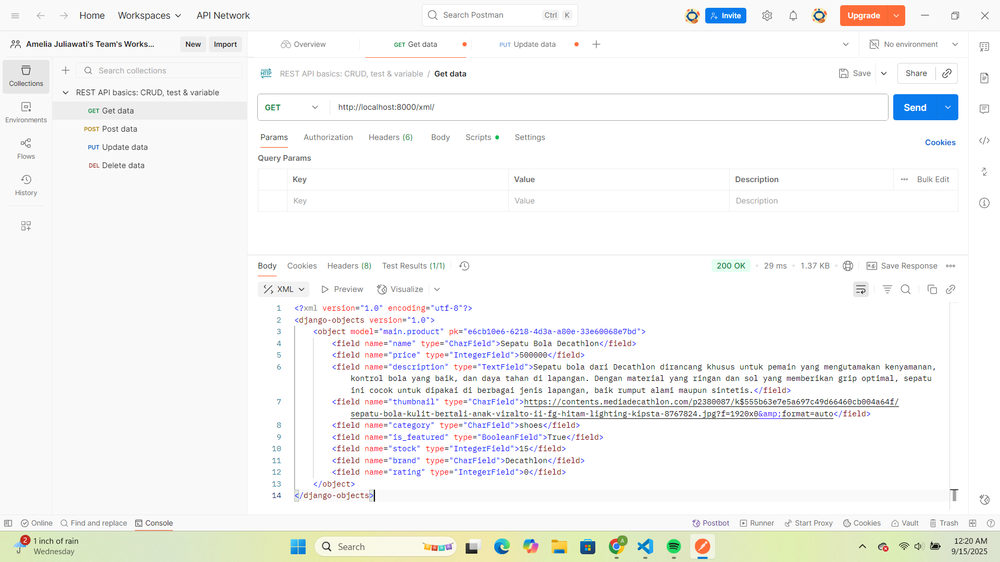
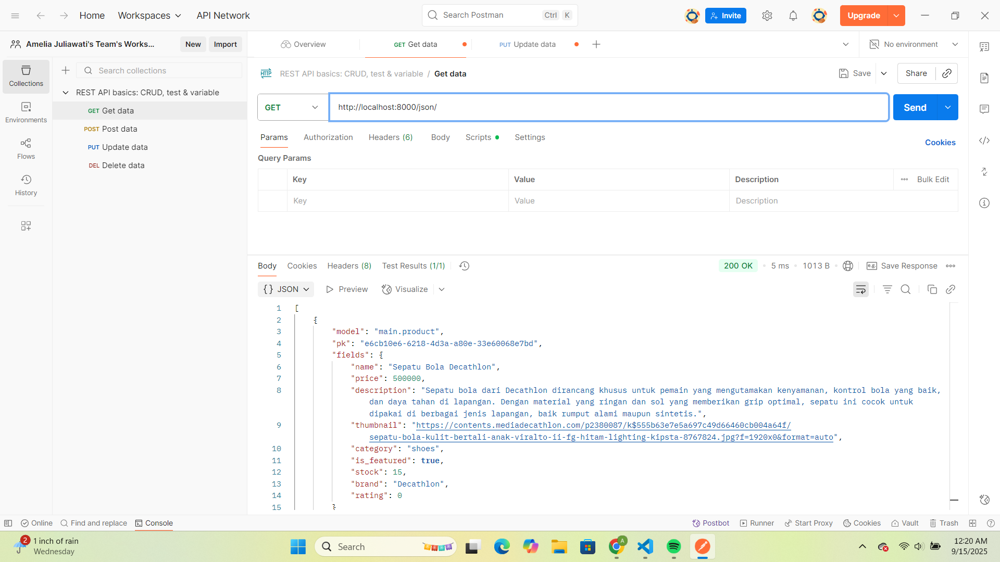
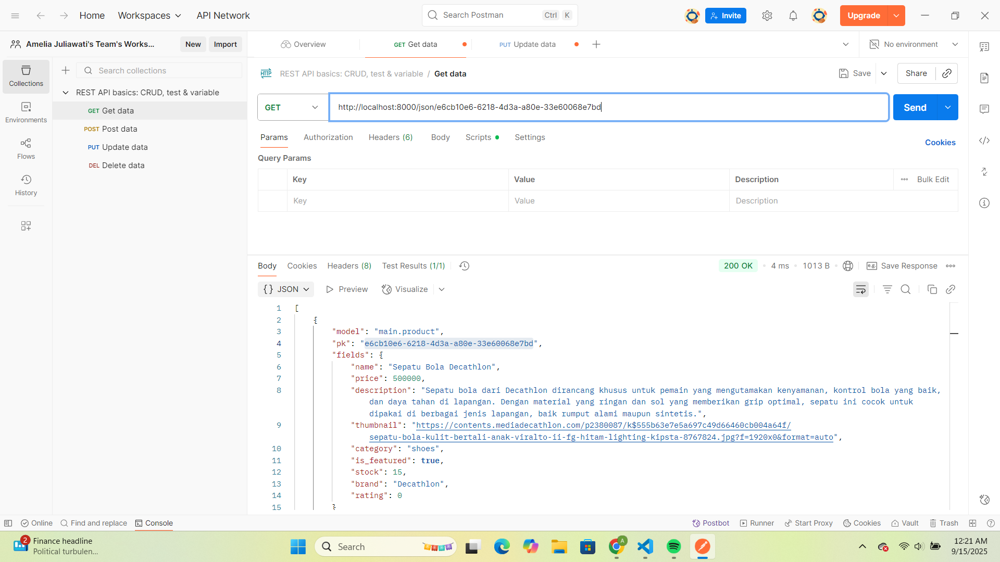
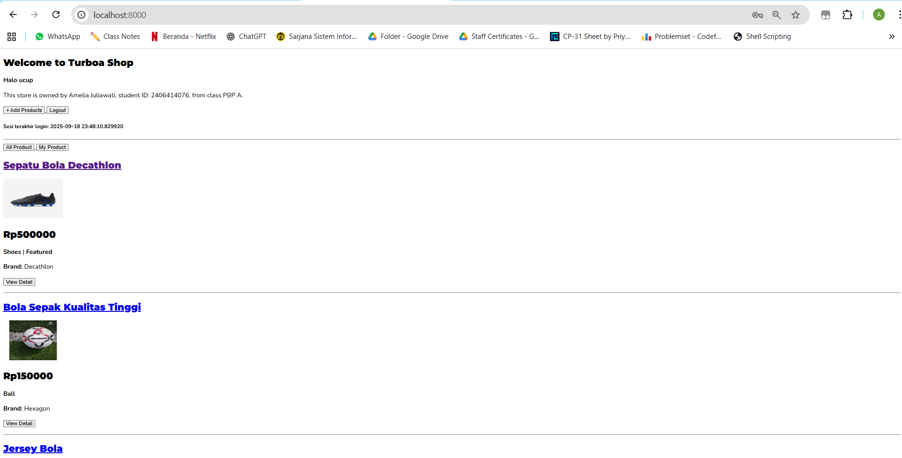
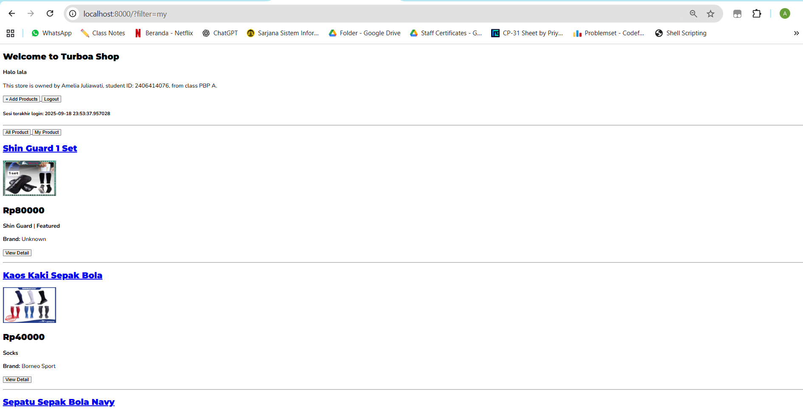
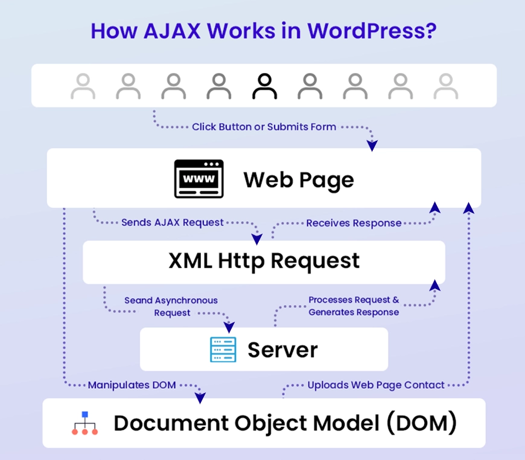
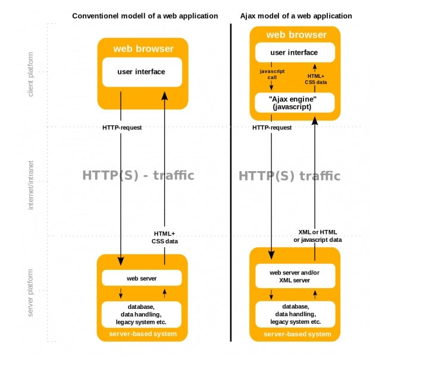

## Tugas 2

Untuk mengakses aplikasi PWS yang sudah di-deploy, dapat diklink link berikut : https://amelia-juliawati-footballshop.pbp.cs.ui.ac.id/

**Penjelasan checklist tugas :**

**Step-by-step membuat sebuah proyek Django baru**
1. Membuat repositori baru di Github yang bernama football-shop. 
2. Melakukan cloning ke repositori lokal dan menghubungkan repositori lokal saya agar saya dapat melakukan perubahan di device lokal saya. 
3. Mengaktifkan virtual environment agar proyek saya tidak bertabrakan dengan versi lain yang ada pada komputer saya atau agar lingkungan proyek (package dan dependensi) ini terisolasi. Virtual environment ini akan selalu saya aktifkan setiap kali saya sedang bekerja dengan proyek saya.
4. Mengunduh semua requirement yang dibutuhkan (termasuk django) agar proyek dapat dibuat dengan baik. 
5. Membuat proyek django dengan menjalankan perintah *django-admin startproject football_shop .*. 
6. Membuat beberapa file yang dibutuhkan, seperti file .env dan .env.prod. untuk membuat lingkungan development agar proyek dapat berjalan, baik untuk testing maupun untuk diakses melalui tautan. 
7. Agar proyek saya dapat diakses melalui link yang telah tertera di atas, saya juga membuat proyek baru pada PWS yang penjelasannya dapat dilihat di bawah. 
8. Mengatur bagian settings.py agar proyek dapat berjalan secara lancar dan dapat diakses melalui link di atas. 
9. Menambahkan .gitignore agar Git mengabaikan file privasi dan tidak dimasukkan di GitHub.

**Step-by-step membuat aplikasi dengan nama main**
1. Menjalankan perintah *python manage.py startapp main* yang mengartikan bahwa main (berupa direktori) akan terbentuk dengan file lainnya yang juga telah diberikan sebagai struktur dasar. 
2. Menambahkan *main* sebagai isi dari list INSTALED_APPS yang berada pada settings.py agar Django dapat mengetahui bahwa ada suatu aplikasi bernama main dan aplikasi tersebut dapat diakses. 

**Step-by-step melakukan routing pada proyek**
1. Mengakses file *urls.py* dalam direktori proyek, bukan direktori aplikasi *main*
2. Menambahkan fungsi include dari *django.urls* pada bagian import (bagian atas)
3. Meambahkan rute URL aplikasi *main*, yaitu main.urls dalam list *urlpatterns*. Path diarahkan ke string kosong agar main menjadi halaman utama.

**Step-by-step membuat model pada aplikasi main**
1. Membuka dan mengisi *models.py* yang telah disediakan sebagai file kosong (struktur dasar) pada direktori aplikasi main. Dibuat kelas bernama Product sebagai model. Lalu, dibuat pilihan kategori yang ada. Setelah itu, ditambahkan beberapa atribut yang diminta dan tambahan dengan spesifikasi yang sesuai (misal nilai default atau maksimal huruf). 
2. Membuat migrasi model agar Django dapat melacak perubahan pada model basis data yang saya miliki. Saya menjalankan perintah *python manage.py makemigrations* di terminal untuk menciptakan file migrasi yang berisi perubahan model.
3. Menetapkan migrasi yang sudah dibuat sebelumnya dengan menjalankan perintah *python manage.py migrate* di terminal.

**Step-by-step membuat fungsi pada views.py**
1. Membuat direktori baru, yaitu templates dan membuat file bernama *main.html* yang akan berisi teks yang akan dilihat ketika proyek pertama kali dibuka
2. Menambahkan baris import yang dibutuhkan pada views.py. Saya menambahkan fungsi render untuk menghubungkan view dengan template menggunakan data yang saya masukkan
3. Mengisi file *main.html* dengan teks dan juga sintaks yang diinginkan menggunakan template variables agar dapat menampilkan nilai dari variables pada views.py
4. Membuat fungsi show_main dengan context yang berisi data yang dibutuhkan untuk diperlihatkan di *main.html*

**Step-by-step membuat routing pada urls.py aplikasi main**
1. Membuat file *urls.py* di dalam direktori *main* agar terpisah dari routing proyek utama.
2. Mengisi file *urls.py* dengan import fungsi yang dibutuhkan, mendefinisikan nama untuk main, dan membuat list *urlpatterns* yang berisi pemetaan URL ke fungsi di *views.py*, yaitu show_main agar aplikasi langsung menunjukkan halaman utama

**Step-by-step melakukan deployment ke PWS**
1. Membuka halaman PWS dan login menggunakan SSO
2. Membuat proyek baru dan mengisi project name dengan footballshop
3. Menyimpan informasi mengenai username dan password
4. Menyalin isi file .env.prod untuk kemudian di-paste pada Project Environment Variables. Hal ini dapat dilakukan dengan mengakses tab Environs dan Raw Editor. SCHEMA yang saya gunakan adalah tugas_individu. 
5. Menambahkan URL deployment PWS pada settings.py. Saya menambahkan informasi pada ALLOWED_HOST dengan memasukkan URL saya sesuai dengan format
6. Melakukan git add, commit, dan push agar perubahan dapat tersimpan di GitHub
7. Menjalankan perintah yang tersedia pada Project Command, yaitu untuk remote add pws, membuat branch, dan melakukan push pws master. Setelah itu, proyek sudah dapat diakses pada tautan PWS

**Bagan Request Client ke Web Aplikasi Berbasis Django**

Link gambar bagan : https://drive.google.com/file/d/1GuhQV8q4nPcqB9mLlcMjt2YGM1-1fRNb/view?usp=sharing
* highlight biru = komponen yang digunakan (misal pengguna menggunakan browser) atau dibuat (misal membuat Model menggunakan models.py)
* highlight merah = komponen eksternal atau pihak ketiga

Berdasarkan bagan yang telah dibuat, dapat dilihat alur interaksi pengguna dengan aplikasi. Pertama, pengguna akan mengakses web server, yang kemudian meneruskan request ke WSGI untuk membuka aplikasi web berbasis Django. Setelah itu, akan dilakukan proses URL Resolution, yaitu mencocokkan URL request dari pengguna dengan URL patterns yang ada di Django. Pada tahap ini, *urls.py* berfungsi sebagai alat bantu untuk routing atau mengarahkan request pengguna agar dapat menampilkan halaman yang sesuai dengan *views.py*. Django pertama-tama akan memeriksa *urls.py* pada level proyek untuk menentukan rute yang cocok. Jika ditemukan kecocokan, request akan diteruskan ke *urls.py* level aplikasi (misalnya melalui include()) untuk menampilkan tampilan utama aplikasi. Jika tidak ada kecocokan, Django akan menampilkan error 404 Not Found. Setelah pencocokan URL dengan *urls.py* berhasil, Django akan memanggil *views.py* yang berisi logika aplikasi dan menyiapkan data yang kemudian akan dikirim ke pengguna dengan memanggil *models.py*. *models.py* mendefinisikan struktur data dan berperan sebagai penyedia query interface untuk database yang berfungsi untuk mengambil, menyimpan ataupun memproses data. Setelah data diproses melalui *models.py*, *views.py* akan memanggil template atau file html yang berfungsi sebagai struktur format untuk menampilkan data kepada pengguna. Hasil render template kemudian akan dikembalikan sebagai response ke pengguna. 

**Peran settings.py**

Pada Django, *settings.py* berfungsi sebagai file konfigurasi utama yang mengatur berbagai aspek proyek. Di dalam *settings.py* terdapat informasi tentang koneksi database yang diatur melalui DATABASES, daftar aplikasi yang aktif melalui INSTALLED_APPS (dimana kita dapat memasukkan aplikasi yang telah kita buat, contohnya main), konfigurasi keamanan dan pengaturan global seperti TIME_ZONE dan LANGUAGE_CODE, serta konfigurasi untuk development dan production melalui variabel environment (misalnya .env pada proyek ini). Pada *settings.py* juga terdapat pengaturan routing proyek, sehingga aplikasi dapat diakses melalui URL tertentu, contohnya link PWS yang digunakan pada proyek ini. Tanpa *settings.py*, Django tidak akan mengetahui bagaimana suatu proyek dijalankan dan fitur-fitur penting seperti database, aplikasi, serta routing tidak akan berfungsi dengan benar.

**Cara Kerja Migrasi Database di Django**

Migrasi database adalah suatu mekanisme di Django untuk menyinkronkan setiap perubahan yang dibuat pada *models.py* dengan struktur database sehingga database dapat menyimpan perubahan tersebut. Ketika dijalankan perintah *python manage.py makemigrations* di terminal, Django akan memeriksa semua perubahan yang terjadi pada model. Sesuai dengan namanya, perintah ini akan membuat file migrasi yang berisi perubahan model yang belum diterapkan di database. File ini berisi perintah SQL yang merepresentasikan perubahan tersebut, misalnya membuat tabel baru, menambah kolom, atau mengubah tipe data kolom. Setelah itu, migrasi akan dijalankan dengan menggunakan perintah *python manage.py migrate*. Pada tahap ini, Django akan membaca file migrasi yang telah dibuat sebelumnya untuk kemudian dijalankan atau mengeksekusi perintah SQL di database agar perubahan dapat diterapkan di database. Django juga menyimpan status migrasi yang sudah dijalankan di tabel django_migrations agar dapat diketahui migrasi mana yang sudah diterapkan dan migrasi baru yang perlu dijalankan.

**Alasan Django Dijadikan Framework Permulaan**

Menurut saya, Django merupakan framework yang sangat sesuai sebagai permulaan pembelajaran pengembangan perangkat lunak karena kemudahan yang ditawarkannya bagi pengembang. Django memungkinkan kita untuk mengembangkan suatu aplikasi dengan cepat dikarenakan banyak fitur bawaan yang dapat langsung digunakan, seperti autentikasi, routing, ORM, dan lain-lain. Selain itu, Django menggunakan bahasa pemrograman Python yang cenderung lebih mudah dipahami dan lengkap dibandingkan bahasa lain. Fitur-fitur Python juga dapat langsung dimanfaatkan dalam Django. 

Django bersifat gratis dan open source sehingga memiliki komunitas pengguna yang besar. Hal ini memudahkan pengguna untuk mendapatkan bantuan ketika menghadapi masalah. Selain itu, dengan pola arsitektur MVT dan struktur folder serta file yang mudah dimengerti, Django mempermudah pengguna untuk memahami alur pengerjaan suatu proyek. Django juga unggul dalam hal keamanan dikarenakan sudah memiliki proteksi bawaan sehingga pengembang dapat lebih fokus pada pengembangan aplikasi. Django juga fleksibel untuk pengembangan berbagai jenis proyek karena kompatibel dengan berbagai jenis database dan mampu menangani trafik tinggi pada proyek berskala besar.

## Tugas 3

**Jelaskan mengapa kita memerlukan data delivery dalam pengimplementasian sebuah platform?**

Dalam mengimplementasikan suatu platform, seringkali diterapkan konsep data delivery yaitu proses mengenai bagaimana suatu data dikirim atau didistribusikan hingga dapat digunakan oleh pengguna ataupun sistem lain dengan cara yang tepat, cepat, dan aman. Utamanya, hal ini diperlukan agar suatu platform dapat menyajikan dan menerima data dari pengguna (misalnya platform yang perlu meminta data pengguna) dengan cepat dan tepat. Dalam pembuatan suatu platform, biasanya terdapat banyak komponen yang saling membutuhkan data satu sama lain, misalnya dalam proyek ini dibutuhkan data dalam format XML dan JSON, atau HTML yang mengambil data dari views.py untuk menampilkan halaman yang sesuai. Dengan adanya data delivery, dapat dipastikan bahwa semua komponen menerima data yang sama, terbaru, dan konsisten. Selain itu, data delivery juga mendukung performa platform agar lebih responsif terhadap pengguna. Tanpa data delivery yang baik, informasi dapat telat sampai, tidak konsisten, atau bahkan salah, khususnya pada platform yang membutuhkan data real-time. Kondisi ini tentunya dapat membuat pengalaman pengguna menjadi buruk, misalnya ketika data tidak terkirim atau lambat. Selain itu, dengan mekanisme pengiriman data yang terstruktur, platform juga dapat menghindari redundansi dan meminimalkan beban sistem dari risiko pengiriman data berulang. Data delivery juga memungkinkan integrasi antar sistem dapat berjalan dengan lancar, terlebih untuk platform yang terhubung dengan layanan atau sistem pihak ketiga, misalnya sistem pembayaran di aplikasi e-commerce.

**Menurutmu, mana yang lebih baik antara XML dan JSON? Mengapa JSON lebih populer dibandingkan XML?**

JSON (JavaScript Object Notation) dan XML (eXtensible Markup Language) adalah format yang digunakan untuk menyimpan, membaca, dan menukar data dari suatu web server sehingga dapat diakses dan dibaca oleh pengguna. Meskipun memiliki fungsi yang mirip, keduanya memiliki perbedaan yang cukup signifikan. Salah satu perbedaan mendasar adalah cara menyimpan elemen. JSON menyimpan elemen dengan efisien melalui struktur sederhana seperti array, object, dan nilai primitif. Namun, hasil penyimpanannya seringkali dianggap kurang rapi. Sedangkan XML menyimpan elemen menggunakan struktur yang lebih kompleks dan terorganisir dengan baik, sehingga mudah dibaca oleh manusia maupun mesin, tetapi kurang efisien karena membutuhkan lebih banyak tag. Kemudian untuk penerapannya, JSON umumnya digunakan untuk mengirimkan data dengan diuraikan dan dikirim melalui internet karena lebih ringan dan mudah diproses, sedangkan XML lebih terstruktur dan pengguna juga dapat menggunakannya untuk menambahkan suatu catatan. XML lebih sering digunakan pada sistem atau aplikasi lama, sedangkan JSON lebih cocok untuk aplikasi modern. Oleh karena itu, penggunaan XML dan JSON dapat disesuaikan tergantung dengan tujuan penggunaan. Menurut saya, JSON adalah format yang lebih baik untuk digunakan dikarenakan sistem penyimpanan data yang sederhana (dilakukan dalam bentuk array dan object) sehingga proses transfer data dapat menjadi lebih mudah. Pada saat ini, tidak dapat dipungkiri bahwa JSON jauh lebih populer dibandingkan dengan XML. Hal ini disebabkan oleh keunggulan JSON, yaitu mendukung banyak bahasa pemrograman, lebih efisien karena sintaksnya ringan dan berukuran kecil, lebih mudah dibaca oleh karena bentuknya yang ringkas (berupa array dan object), serta lebih cepat dalam proses parsing di sisi server. Kelebihan-kelebihan tersebut membuat JSON menjadi lebih unggul dan sesuai untuk platform modern yang harus menangani data dalam jumlah besar secara cepat.

**Jelaskan fungsi dari method is_valid() pada form Django dan mengapa kita membutuhkan method tersebut?**

Method *is_valid* pada form Django berfungsi untuk mengecek apakah data yang dikirimkan ke form telah sesuai dengan aturan validasi yang telah didefinisikan sebelumnya (di model atau form). Tentunya dalam sebuah platform, ketika pengguna ingin memasukkan sebuah data, pengembang biasanya telah menentukan terlebih dahulu data apa saja yang diterima (misal nama, harga, deskripsi, dan lain-lain), tipe data yang benar, serta batasan dalam penerimaan data tersebut. Dengan dijalankannya metode ini, Django akan memeriksa apakah semua field yang wajib diisi sudah terisi. Setelah itu, akan dilakukan validasi tipe data, misalnya memastikan bahwa price meminta tipe data berupa angka (long atau integer), bukan string. Django juga akan memeriksa apabila ada batasan khusus yang mungkin ditambahkan melalui validators. Jika semua validasi terpenuhi, maka *is_valid* akan mengembalikan nilai True sehingga data dapat diakses dan diproses. Sebaliknya, jika terjadi suatu error atau adanya kesalahan input, maka *is_valid* akan mengembalikan False dan Django akan menyediakan pesan error yang dapat ditampilkan ke pengguna. Dalam mengelola suatu platform, tentunya kita harus memastikan bahwa data yang diterima sesuai dengan kebutuhan dan aturan yang berlaku. Hal inilah yang membuat metode *is_valid* dibutuhkan. Metode ini akan menjamin data yang masuk aman, konsisten, dan sesuai dengan aturan serta batasan yang ada. Hal ini dapat membantu untuk mencegah terjadinya suatu kerusakan di database akibat data yang salah atau tidak sesuai. Selain itu, metode ini juga sangat bermanfaat untuk pengguna jika salah melakukan input karena akan ada pesan langsung yang ditampilkan padanya.

**Mengapa kita membutuhkan csrf_token saat membuat form di Django? Apa yang dapat terjadi jika kita tidak menambahkan csrf_token pada form Django? Bagaimana hal tersebut dapat dimanfaatkan oleh penyerang?**

*csrf_token* pada Django merupakan suatu lapisan keamanan yang digunakan untuk mencegah serangan CSRF (Cross-Site Request Forgery). *csrf_token* adalah suatu nilai unik, rahasia, dan tidak dapat diprediksi yang dibuat oleh server dan disimpan pada sesi pengguna. Ketika pengguna mencoba untuk melakukan suatu hal yang bersifat sensitif, misalkan mengirimkan sebuah form, maka Django akan memeriksa apakah token yang dikirim bersama form cocok dengan token yang ada pada sesi pengguna. Jika cocok, maka request dianggap valid dan akan diproses lebih lanjut. Namun, bila tidak cocok, maka request tersebut akan ditolak. Hal ini membuat penyerang sangat kesulitan untuk membuat request atau melakukan aksi berbahaya seperti berperan sebagai pengguna asli dikarenakan tidak memiliki token tersebut. 

Jika kita tidak menambahkan *csrf_token* saat membuat form di Django, aplikasi akan menjadi rentan terhadap serangan CSRF. CSRF adalah suatu jenis penyerangan dimana penyerang membuat browser korban mengirimkan request ke web tujuan tanpa sepengetahuan korban. Dikarenakan browser otomatis mengirimkan cookie sesi, server tujuan akan mengira bahwa itu adalah request valid dari korban yang membuat korban "terpaksa" melakukan request yang tidak ia inginkan. Jika tidak ada *csrf_token* sebagai salah satu cara preventatif penyerangan CSRF, maka server tidak dapat mengetahui apakah request yang dikirimkan benar-benar berasal dari pengguna atau berasal dari penyerang. Hal ini dikarenakan tidak ada alat bantu yang dapat mengecek dan memastikan hal tersebut. Hal ini dapat dimanfaatkan oleh penyerang dengan cara memaksa masuk dan membuat request yang membuat korban "terpaksa" melakukan suatu request ke suatu server. Salah satu contoh CSRF adalah ketika suatu pengguna login di suatu web yang tidak menggunakan *csrf_token*, maka browser akan menyimpan cookie sesi. Penyerang yang telah membuat halaman berisi form tersembunyi mengirim POST ke web tersebut untuk mengganti email agar dapat mengambil alih akun pengguna. Pengguna yang tidak tahu tidak sengaja mengunjungi halaman penyerang di tab lain dan script pun otomatis melakukan submit form. Browser pengguna akan mengirim request ke web tersebut dan request akan diproses karena dianggap berasal dari pengguna. Akhirnya, email berubah tanpa sepengetahuan korban.

**Jelaskan bagaimana cara kamu mengimplementasikan checklist di atas secara step-by-step (bukan hanya sekadar mengikuti tutorial).**

**Menambahkan 4 fungsi views baru**

1. Menambahkan import *Product*, *HttpResponse*, dan *Serializer* pada *views.py* sebagai class yang dibutuhkan
2. Membuat fungsi *show_xml* yang menerima input berupa request dari pengguna dan mengembalikan data semua objek dari Product dalam bentuk format XML
3. Membuat fungsi *show_json* yang menerima input berupa request dari pengguna dan mengembalikan data semua objek dari Product dalam bentuk format JSON
4. Membuat fungsi *show_xml_by_id* yang menerima input berupa request dari pengguna dan sebuah id produk. Fungsi ini akan mengembalikan data suatu objek dari Product dengan id tersebut dalam bentuk format XML
5. Membuat fungsi *show_json_by_id* yang menerima input berupa request dari pengguna dan sebuah id produk. Fungsi ini akan mengembalikan data suatu objek dari Product dengan id tersebut dalam bentuk format JSON

**Membuat routing URL**

1. Menambahkan import fungsi yang telah dibuat yaitu *show_xml, show_json, show_xml_by_id, show_json_by_id* pada *urls.py* 
2. Menambahkan keempat path URL ke dalam *urlpatterns* untuk dapat mengakses fungsi yang sudah diimpor tadi.

**Membuat halaman yang memiliki tombol "Add" dan "Detail"**

1. Membuat direktori templates dan file bernama *base.html* yang berguna sebagai kerangka umum (layout) proyek HTML.
2. Menambahkan templates sebagai directory di *settings.py* agar file *base.html* dapat dikenali oleh Django
3. Membuat file baru bernama *forms.py* pada direktori *main* untuk mendefinisikan struktur form yang menerima input data produk baru.
4. Menambahkan import baru pada *views.py*, yaitu redirect, get_object_or_404, dan ProductForm sebagai kelas atau fungsi yang dapat digunakan pada *views.py*
5. Membuat fungsi baru, yaitu *create_products* untuk menambahkan suatu produk baru. Fungsi ini menerima input request dari pengguna dan akan memberikan hasil yaitu Product yang telah dibuat jika isi form valid dan pengguna telah mengirim data dengan metode POST.
6. Membuat fungsi baru, yaitu *show_products* untuk menampilkan detail suatu produk. Fungsi ini menerima input berupa request dan juga suatu id produk dan akan memberikan informasi berupa detail suatu produk dalam bentuk halaman yang telah dirender
7. Menambahkan suatu variabel baru yaitu *products_list* yang berisi semua data produk
8. Menambahkan *products_list* pada context fungsi *show_main*
9. Melakukan import fungsi yang telah dibuat pada *urls.py* pada direktori *main*
10. Menambahkan path URL kedua fungsi tersebut ke dalam variabel *urlpatterns*
11. Mengubah dan menyesuaikan halaman *main.html* pada direktori *main/templates* agar dapat menampilkan data produk serta tombol "Add" dan "Detail". Untuk menambahkan suatu tombol digunakan keyword <button>, yang digunakan untuk membuat tombol "Add" dan "Detail". Selain itu, setiap tombol menggunakan atribut href (hyperlink reference) agar dapat mengarah ke halaman yang sesuai. Button "Add Products" akan mengarahkan ke *create_products.html*, lalu button "View Detail" akan mengarahkan ke *products_detail.html*.

**Membuat halaman form**

1. Membuat file baru, yaitu *create_products.html* pada direktori *main/templates*.
2. Menambahkan kode pada *create_products.html* untuk menampilkan template form ketika diisi oleh pengguna. File ini juga meng-extend *base.html*
3. Menambahkan entri url proyek pws pada CSRF_TRUSTED_ORIGINS di *settings.py* agar url proyek dianggap aman saat melakukan request POST

**Membuat halaman yang menampilkan detail**

1. Membuat suatu file baru, yaitu *products_detail.html* pada direktori *main/templates*.
2. Menambhakn kode pada file tersebut sebagai template ketika pengguna melihat detail suatu produk. File ini juga meng-extend *base.html*

**Apakah ada feedback untuk asdos di tutorial 2 yang sudah kalian kerjakan?**

Asdos telah membimbing saya untuk mengikuti tutorial dengan sangat baik dan jelas.

**Screenshot URL pada Postman**

1. show_xml

2. show_json

3. show_xml_by_id

4. show_json_by_id

## Tugas 4
**Apa itu Django AuthenticationForm? Jelaskan juga kelebihan dan kekurangannya.**

Django AuthenticationForm adalah form bawaan dari Django yang terdapat di dalam modul django.contrib.auth.forms. Form ini secara otomatis menyediakan field yang diperlukan, yaitu username dan password, serta menerapkan validasi dan memverifikasi kredensial yang dimasukkan oleh pengguna terhadap database pengguna yang terdaftar. AuthenticationForm biasanya digunakan dalam proses login untuk memastikan bahwa username dan password yang dimasukkan memang valid sesuai dengan sistem autentikasi Django. Django AuthenticationForm memiliki sejumlah kelebihan dan kekurangan. Kelebihan yang paling menonjol tentunya adalah sifatnya sebagai bawaan atau fitur built-in dari Django. Hal ini membuat pengembang tidak perlu membuat kode autentikasi dari nol sehingga dapat menghemat waktu. Selain itu, AuthenticationForm juga telah terintegrasi langsung dengan model User, fungsi authenticate(), dan login(). Hal ini membuat pengembang dapat menggunakan fitur untuk autentikasi dan login dengan mudah dan cepat tanpa perlu membuat kodenya dari awal. Selain itu, AuthenticationForm dari Django juga sudah memiliki fungsi validasi, misalnya memastikan bahwa username dan password cocok atau memberikan pesan error jika terjadi kesalahan. Dari sisi keamanan, form ini juga telah menerapkan beberapa proteksi keamanan, seperti hashing password, proteksi brute-force dengan middleware tambahan, dan perlindungan dari SQL Injection. Hal ini membuat pengembang tidak perlu khawatir terjadinya data breach atau risiko keamanan lainnya ketika pengguna sedang melakukan proses login. Meskipun begitu, AuthenticationForm juga memiliki sejumlah kekurangan. Sebagai fitur bawaan, form ini tidak terlalu fleksibel. Jika pengembang menginginkan fitur login yang menggunakan email, nomor telepon, atau data lain, pengembang harus membuat custom form atau melakukan override karena secara default AuthenticationForm hanya mendukung autentikasi dengan username dan password. Selain itu, dari sisi tampilan, AuthenticationForm juga memiliki tampilan sederhana yang mungkin kurang menarik untuk dilihat, sehingga biasanya memerlukan penyesuaian manual untuk memberikan tampilan yang menarik secara visual. Form bawaan ini juga tidak terlalu cocok untuk kebutuhan autentikasi yang lebih kompleks, seperti login bertahap (multi-step login) atau implementasi two-factor authentication (2FA).

**Apa perbedaan antara autentikasi dan otorisasi? Bagaiamana Django mengimplementasikan kedua konsep tersebut?**

Meskipun sering terdengar mirip, autentikasi dan otorisasi merupakan dua konsep yang berbeda. Autentikasi adalah proses validasi atau konfirmasi data, seperti username dan password, yang dilakukan untuk memverifikasi identitas pengguna. Autentikasi bertujuan untuk memastikan bahwa pengguna benar-benar merupakan orang yang ia klaim. Beberapa cara yang biasa digunakan dalam proses autentikasi adalah memasukkan username dan password, menerima email verifikasi, dan memasukkan kode OTP. Misalnya, ketika seorang pengguna login ke suatu akun dengan memasukkan username dan password, sistem akan menjalankan proses autentikasi untuk memeriksa apakah data tersebut sesuai dengan yang ada di database. Jika sesuai, maka pengguna dianggap berhasil diautentikasi. Sedangkan, otorisasi adalah proses untuk menentukan apakah pengguna yang telah diautentikasi sebelumnya memiliki akses atau izin terhadap sumber daya tertentu. Proses otorisasi dijalankan setelah proses autentikasi. Proses ini bertujuan untuk menentukan dan mengatur hak akses yang dimiliki oleh pengguna. Misalnya, dalam suatu platform e-commerce, pengguna yang memiliki role sebagai penjual memiliki hak akses untuk mengubah informasi produk miliknya, seperti menambahkan stok atau menurunkan harga, sedangkan pengguna yang tidak memiliki role penjual (pengguna biasa) hanya dapat melihat suatu produk tanpa mengubahnya. 

Kedua konsep ini telah diimplementasikan di Django melalui modul bawaan. Konsep autentikasi telah disediakan melalui modul bawaan Django, yaitu django.contrib.auth. Django telah menyediakan User sebagai model untuk menyimpan data kredensial pengguna dan form bawaan yaitu AuthenticationForm. Selain itu, Django juga menyediakan fungsi login() dan logout() untuk menyimpan dan mengatur informasi pengguna dalam suatu sesi (menggunakan cookies). Django juga menyediakan fungsi authenticate() sebagai inti dari proses autentikasi. Cara kerja fungsi ini adalah dengan mencari User berdasarkan username, lalu mengambil password yang telah di-hash dari database dan membandingkannya dengan hash dari password yang dimasukkan pengguna. Jika passwordnya cocok, maka ia akan mengembalikan objek User yang berarti pengguna telah terautentikasi. Selain itu, Django juga telah mengimplementasikan konsep otorisasi untuk membatasi hak akses pengguna. Setelah pengguna telah terautentikasi, Django akan menentukan apakah seorang User memiliki hak untuk melakukan suatu tindakan. Hal ini dapat dilakukan dengan decorators dan modul lainnya. Pada platform ini, digunakan salah satu otorisasi dari Django, yaitu decorator @login_required. Decorator ini hanya memperbolehkan user yang sudah login untuk dapat menjalankan fungsi tersebut. Jika belum, maka user akan di redirect ke halaman login. Ada banyak decorator dan kelas lain sebagai modul bawaan Django untuk proses otorisasi, seperti Permissions, Groups, dan juga @permission_required. 

**Apa saja kelebihan dan kekurangan session dan cookies dalam konteks menyimpan state di aplikasi web?**

Cookies adalah file teks kecil yang disimpan pada perangkat pengguna atau di sisi klien ketika mengunjungi suatu website. File ini berisi data atau informasi mengenai aktivitas pengguna, seperti preferensi, data login, atau barang di keranjang yang berguna untuk membantu website dapat mengenali pengguna dan mengingat pilihannya. Setiap kali pengguna melakukan request ke server melalui HTTP, cookies akan otomatis dikirimkan oleh browser. Cookies memiliki sejumlah kelebihan, salah satunya adalah persistensinya. Cookies dapat bertahan lama dalam menyimpan state di aplikasi web. Bahkan setelah browser ditutup, cookies akan tetap mengingat preferensi pengguna, seperti tema atau bahasa yang dipilih sehingga ketika pengguna mengakses web tersebut lagi, pengguna tetap mendapatkan preferensi yang sesuai. Selain itu, cookies juga tidak membebani server dikarenakan data disimpan di perangkat pengguna. Browser juga secara otomatis mengirimkan cookies yang relevan dari perangkat pengguna ke server pada setiap request yang dilakukan sehingga browser dapat mengingat state dengan mudah. Namun, cookies juga memiliki sejumlah kekurangan. File cookies memiliki batasan dalam ukurannya dan setiap cookies biasanya maksimal berukuran sekitar 4KB sehingga sangat tidak cocok untuk menyimpan data besar. Selain itu, cookies juga memiliki tingkat keamanan yang rendah. Dikarenakan browser selalu mengirimkan cookies, penyerang bisa saja mengeksploitasinya dengan membuat korban melakukan request yang tidak diinginkan ke web target ketika pengguna telah terautentikasi (CSRF). Selain itu, cookies yang tidak ditandai dengan "HttpOnly" dapat diubah dan dibaca langsung oleh pengguna sehingga berpotensi menimbulkan masalah keamanan. 

Session merupakan sebuah mekanisme penyimpanan data di server yang dihubungkan dengan seorang pengguna. Biasanya, setiap sesi memiliki identifier unik atau sering disebut Session ID yang disimpan di cookies pengguna sebagai penanda untuk menghubungkan server dan pengguna. Session mencatat data terkait aktivitas pengguna selama mengakses website, mulai dari saat masuk ke halaman utama hingga menutup website, termasuk interaksi yang dilakukan. Session memiliki sejumlah kelebihan. Dikarenakan disimpan di server, session dapat menyimpan data dalam jumlah besar. Penyimpanan session ini hanya dibatasi oleh kapasitas memori atau penyimpanan server (RAM, database, cache, dan lain-lain) yang cenderung besar sehingga cocok untuk menyimpan informasi yang cukup kompleks dan besar. Selain itu, session juga memiliki tingkat keamanan yang lebih tinggi dikarenakan data sensitif, seperti User ID atau keranjang belanja disimpan di server, bukan di pengguna, sehingga pengguna tidak dapat mengakses data secara langsung dan mengubahnya. Klien hanya menyimpan Session ID yang juga sudah memiliki mekanisme pengamanannya sendiri dan berukuran kecil sehingga tidak membebani bandwidth. Namun, session juga memiliki sejumlah kekurangan. Dikarenakan setiap data session disimpan di server, server bisa saja terbebani jika jumlah pengguna sangat banyak. Selain itu, session biasanya terhapus ketika browser ditutup kecuali dikombinasikan dengan cookies. Penerapan session ini juga memerlukan kompleksitas yang lebih tinggi karena dibutuhkan konfigurasi dan pemeliharaan di sisi server yang lebih kompleks, seperti pemilihan dan pemeliharaaan storage, pengelolaan sesi, dan lain-lain. Pada aplikasi atau website kompleks dengan banyak server, session juga harus disinkronkan. Session juga biasanya tetap bergantung pada cookies dikarenakan Session ID umumnya disimpan di cookies meskipun data sebenarnya berada di server.

**Apakah penggunaan cookies aman secara default dalam pengembangan web, atau apakah ada risiko potensial yang harus diwaspadai? Bagaimana Django menangani hal tersebut?**

Tidak. Penggunaan cookies secara default memiliki sejumlah risiko potensial yang harus diwaspadai. Salah satu risiko keamanan pada cookies adalah Cross-Site Scripting (XSS). XSS adalah eksploitasi keamanan dimana penyerang menaruh kode berbahaya (biasanya berbentuk JavaScript) ke sebuah website. Jika sebuah website rentan terkena XSS, maka cookie yang tidak diberi atribut HttpOnly dapat dicuri oleh penyerang. Hal ini membuat penyerang dapat membaca cookie pengguna yang mungkin saja berisi informasi sensitif. Selain itu, korban juga dapat terkena session hijacking atau pencurian sesi pengguna ketika cookie yang diambil oleh penyerang berisikan informasi mengenai session ID. Jika penyerang mendapatkan session ID, ia bisa saja menyamar sebagai pengguna tanpa memerlukan username dan password yang valid dan mengeksploitasi hak korban karena telah mendapatkan akses ke akun korban. Selain itu, cookies juga rentan terhadap CSRF (Cross-Site Request Forgery). Browser secara otomatis mengirimkan cookie, termasuk session cookie, untuk setiap request pengguna, terlepas dari apakah request tersebut benar-benar berasal dari pengguna yang sah. Penyerang dapat membuat website berbahaya yang ketika diakses oleh pengguna akan mengirimkan request (misalnya pengambilan uang) ke website yang sedang dibuka pengguna. Browser akan secara otomatis melampirkan cookie pengguna dan melakukan request berbahaya tersebut tanpa sepengetahuan pengguna asli. Selain itu, juga terdapat risiko Man-in-the-Middle (MITM) Attack jika cookies dikirim melalui koneksi http yang tidak terenkripsi. Data cookies dapat disadap oleh pihak yang memiliki akses ke jaringan sehingga data sensitif pengguna dapat tercuri. 

Dalam menangani risiko-risiko keamanan tersebut, Django telah menerapkan beberapa praktik keamanan. Django menggunakan CSRF token sebagai strategi perlindungan terhadap CSRF. CSRF token adalah string unik dan rahasia yang digunakan pada setiap form dan tidak tersimpan di cookie. Ketika request dikirim oleh pengguna, Django akan memverifikasi bahwa token yang diterima sesuai dengan token yang dikeluarkan. Selain itu, Django juga tidak menyimpan data session sensitif secara langsung di cookie secara default. Cookie hanya menyimpan identifier panjang dan acak sebagai session ID, sehingga data sensitif tetap berada di server dan risiko pengubahan atau pengaksesan oleh pihak lain berkurang. Django juga menerapkan konfigurasi default pada cookie sebagai strategi keamanan dengan beberapa atribut. HttpOnly memastikan cookie tidak dapat diakses melalui JavaScript, sehingga mengurangi risiko XSS. Secure menjamin cookie hanya dikirim melalui koneksi HTTPS yang terenkripsi. SameSite dengan default Lax membantu mencegah cookie dikirim pada request lintas situs, sehingga mengurangi risiko CSRF. Selain itu, juga terdapat banyak atribut lain yang membuat cookies di Django menjadi lebih aman.

**Jelaskan bagaimana cara kamu mengimplementasikan checklist di atas secara step-by-step (bukan hanya sekadar mengikuti tutorial).**

**Mengimplementasikan fungsi registrasi, login, dan logout**

1. Menambahkan import kelas dan juga fungsi yang dibutuhkan pada *views.py*. Disini, saya menggunakan beberapa fungsi dan juga kelas bawaan Django, sehingga saya tidak perlu menuliskan semua kodenya dari awal. 
2. Membuat fungsi register menggunakan UserCreationForm di *view.py*. UserCreationForm adalah kelas bawaan Django untuk form registrasi akun baru sehingga dapat langsung digunakan.
3. Membuat file HTML baru pada main/templates yaitu *register.html* sebagai template halaman ketika user melakukan registrasi. *register.html* juga meng-extend *base.html*
4. Membuat fungsi user_login untuk menerima request login dari pengguna. Pada metode ini, juga digunakan fitur bawaan dari Django seperti untuk autentikasi dan login
5. Membuat file HTML baru pada main/templates yaitu *login.html* sebagai template halaman ketika user melakukan login. *login.html* juga meng-extend *base.html*
6. Membuat fungsi user_logout menggunakan fungsi yang telah diimport yaitu logout (fungsi bawaan Django).
7. Menambahkan button logout pada *main.html* di main/templates agar pengguna dapat logout 
8. Menambahkan atau mengimpor fungsi yang sudah dibuat pada *views.py* sebelumnya, yaitu register, user_login, dan user_logout pada *urls.py*
9. Menambahkan path url ketiga fungsi tersebut ke dalam urlpatterns agar fungsi yang sudah diimpor tersebut dapat diakses
10. Membuat halaman utama dan detail produk hanya bisa diakses ketika pengguna sudah login dengan mengimpor fungsi login_required dan membuatnya menjadi decorator pada fungsi show_main dan show_products

**Membuat 2 akun pengguna dengan masing-masing 3 dummy data di lokal**

1. Menjalankan program di lokal dengan mengetik *python manage.py runserver* di terminal
2. Mengakses http://localhost:8000/ untuk membuka proyek yang sedang dijalankan di lokal
3. Membuat akun baru, yaitu dengan langsung melakukan registrasi (di halaman pertama yang ditampilkan). Pada registrasi, perlu diingat bahwa password harus mengikuti ketentuan yang diberikan. Lakukan hal ini sebanyak dua kali atau buat 2 akun baru.
4. Menambahkan produk dengan menekan tombol "+ Add Products" lalu mengisi semua requirements yang dibutuhkan, seperti nama produk, harga, dan lain-lain. Setelah itu, tekan tombol "Add Product" untuk mengirim form ke database. Lakukan langkah ini sebanyak total 6 kali (3 kali untuk masing-masing pengguna)
* untuk mengecek data atau produk yang telah dibuat, masing-masing pengguna dapat memfilter dengan menekan tombol My Product

Pengguna 1 (ucup) dengan 3 produk

Pengguna 2 (lala) dengan 3 product

**Menghubungkan model Product dengan User**

1. Mengimpor kelas User pada *models.py*
2. Menambahkan atribut baru pada kelas Product, yaitu user yang menyimpan informasi tentang pengguna (setiap produk dapat terasosiasi dengan seorang user). Hal ini membuat model Product juga menyimpan informasi tentang pengguna yang membuatnya. Product tanpa user tetap valid dan jika user dihapus, maka semua product yang terhubung oleh user juga akan ikut terhapus.
3. Karena telah dilakukan perubahan pada model, maka akan dibuat file migrasi model dengan *python manage.py makemigrations*
4. Menjalankan migrasi model dengan *python manage.py migrate* 
5. Memodifikasi kode pada fungsi create_products pada *views.py* untuk tidak langsung menyimpan hasil form ke database agar dapat diubah terlebih dahulu. Hal ini dilakukan agar field user dapat diisi dengan request.user sehingga setiap produk akan terhubung dengan pengguna yang membuatnya.
6. Agar implementasi penghubungan suatu produk dengan pengguna lebih jelas, saya juga menerapkan filter. Pada *views.py*, saya menambahkan fungsi untuk melakukan filter pada show_main, yaitu untuk produk yang dibuat oleh pengguna sendiri dan semua produk dari berbagai pengguna.
7. Menambahkan tombol filter My Product dan All Product pada halaman *main.html*
8. Menambahkan data nama penjual atau pengguna yang membuat suatu produk di products_detail.html

**Menampilkan detail informasi pengguna dan menerapkan cookies**

1. Mengimpor fungsi dan kelas yang dibutuhkan pada *views.py* seperti reverse, datetime, dan HttpResponseRedirect
2. Menambahkan dan mengubah kode pada user_login di *views.py* jika form valid dengan menerapkan cookies di dalamnya agar dapat mengakses waktu kapan terakhir kali user melakukan login (last_login) 
3. Menambahkan variabel baru, yaitu last_login pada dictionary context dengan menggunakan cookies pada *views.py*
4. Menambahkan dan mengubah fungsi user_logout agar dapat menghapus cookie ketika pengguna telah logout (menandakan sesinya telah selesai)
5. Menambahkan variabel baru pada dictionary context di *views.py*, yaitu pengguna yang menyimpan informasi tentang username pengguna yang sedang login. Variabel ini didapatkan melalui informasi pengguna melalui *request.user.username*
6. Menampilkan informasi last_login dan username pengguna pada *main.html* pada main/templates

## Tugas 5

**Jika terdapat beberapa CSS selector untuk suatu elemen HTML, jelaskan urutan prioritas pengambilan CSS selector tersebut!**

Dalam suatu elemen HTML, sangat mungkin terdapat lebih dari satu CSS selector yang berlaku. CSS sendiri merupakan singkatan dari Cascading Style Sheet. Istilah cascading merujuk pada konsep gaya (style) yang dapat menimpa atau ditimpa oleh gaya lain sesuai dengan urutan prioritasnya, sesuai dengan arti harafiah dari cascading (bahasa inggris) yang merujuk pada air terjun yang mengalir dari atas ke bawah. Jika suatu elemen HTML menggunakan lebih dari satu CSS selector, maka CSS akan memilih style dengan prioritas tertinggi untuk digunakan pada elemen tersebut. Secara umum, ada empat jenis selector dengan tingkat prioritas yang berbeda. Peringkat pertama adalah inline style, yaitu style yang ditulis langsung pada atribut style di dalam tag HTML. Jenis selector ini memiliki prioritas tertinggi dengan nilai spesifisitas 1,0,0,0. Selanjutnya, ada ID selector dengan nilai 0,1,0,0, contohnya #judul. Setelah itu, ada class selector dengan nilai 0,0,1,0, yang juga mencakup attribute selector dan pseudo-class, seperti .class-name, [type="text"], atau :hover. Peringkat terakhir atau selector dengan prioritas terendah adalah element/tag selector dengan nilai 0,0,0,1, misalnya div, p, atau h1. Jika suatu elemen HTML menggunakan banyak selector sekaligus, maka yang dipilih adalah style dengan nilai spesifisitas tertinggi. Sebagai contoh, suatu elemen html menggunakan selector div p yang terdiri dari dua tag selector dengan total nilai 0,0,0,2, dan juga selector #aaa yang terdiri dari satu ID selector dengan nilai 0,1,0,0. Karena 0,1,0,0 lebih tinggi daripada 0,0,0,2, maka style dari selector #aaa-lah yang akan diterapkan. Namun, CSS juga menyediakan aturan khusus dengan menggunakan perintah !important. Jika sebuah properti diberi !important, maka style tersebut akan mengesampingkan aturan prioritas normal dan langsung menjadi peringkat pertama. Meskipun begitu, penggunaan !important sebaiknya dihindari kecuali benar-benar diperlukan, karena dapat membuat kode CSS sulit untuk dijaga konsistensi dan kerapihannya. Selain urutan prioritas, terdapat juga faktor source order atau urutan kode CSS ketika ditulis. Jika dua selector memiliki tingkat spesifisitas yang sama, maka browser akan memilih selector yang ditulis terakhir dalam kode. Dengan demikian, pengaturan prioritas CSS dipengaruhi oleh tiga hal utama: tingkat spesifisitas selector, penggunaan !important, dan urutan penulisan.

**Mengapa responsive design menjadi konsep yang penting dalam pengembangan aplikasi web? Berikan contoh aplikasi yang sudah dan belum menerapkan responsive design, serta jelaskan mengapa!**

Responsive web design adalah suatu pendekatan yang digunakan untuk membuat website dapat tampil dengan baik pada berbagai ukuran layar dan perangkat. Saat ini, masyarakat menggunakan berbagai perangkat untuk beraktivitas, termasuk mengakses website, seperti laptop, smartphone, dan tablet, yang tentunya memiliki ukuran layar yang berbeda-beda. Terlebih, smartphone menjadi perangkat andalan karena memiliki portabilitas tinggi sehingga sering digunakan. Hal ini menimbulkan kebutuhan untuk membuat website yang dapat beroperasi dengan baik dan sesuai dengan perangkat pengguna masing-masing. Responsive web design adalah suatu teknik dan juga konsep yang bertujuan untuk membuat tampilan website menjadi adaptif terhadap ukuran layar pengguna yang berbeda-beda. Teknik ini memanfaatkan fleksibilitas grid dan tata letak (layout) yang dapat menyesuaikan dengan resolusi dan ukuran layar perangkat. Dengan demikian, pengguna dapat mengakses website dengan mudah dan nyaman dari berbagai perangkat. Penerapan responsive web design memberikan banyak manfaat, sehingga menjadi konsep yang wajib diterapkan dalam pengembangan suatu web. Website yang responsif dapat memberikan pengalaman pengguna yang baik, membuat pengguna lebih sering mengakses web, meningkatkan popularitas, serta jumlah pengunjung. Selain itu, responsive web design juga dapat mempercepat waktu loading karena elemen yang digunakan cenderung lebih efisien dan tidak membutuhkan waktu load yang lama.

Dalam penerapannya, sayangnya belum semua aplikasi menerapkan konsep responsive web design ini. Hal ini menunjukkan suatu perbedaan yang signifikan dengan web yang telah menerapkan konsep responsive web design ini. Sebagai contoh, website Tokopedia, suatu website e-commerce yang dibuat untuk mempermudah transaksi atau jual beli secara online, telah menerapkan konsep responsive web design. Saat diakses melalui desktop atau komputer, halaman menampilkan lebih banyak produk per baris, misalnya satu baris bisa menampilkan sekitar enam produk. Namun, ketika diakses melalui smartphone, tampilan menyesuaikan ukuran layar, sehingga jumlah produk per baris berkurang menjadi dua agar lebih mudah dibaca dan dilihat oleh pengguna. Sebaliknya, contoh website yang belum menerapkan responsive web design adalah SIAKNG, suatu website yang dibuat untuk menampilkan informasi seputar mahasiswa. Tampilan website ini tidak responsif ketika diakses di berbagai perangkat karena menunjukkan tampilan yang senantiasa sama. Ketika diakses melalui smartphone, tampilan website tetap sama seperti di desktop. Akibatnya, beberapa tulisan dan field menjadi sulit dibaca karena ukuran teksnya yang cenderung kecil, sehingga pengguna sering harus melakukan zoom untuk melihat konten dengan jelas. Navbar atau menu seperti Home, Akademik, Kalender, dan lainnya juga sulit diakses karena ukurannya tidak menyesuaikan perangkat, seperti terlalu kecil untuk diakses di smartphone sehingga sering membuat pengguna salah mengakses halaman. Hal ini tentunya membuat pengalaman pengguna menjadi kurang nyaman dan cenderung sulit.

**Jelaskan perbedaan antara margin, border, dan padding, serta cara untuk mengimplementasikan ketiga hal tersebut!** 

Margin, border, dan padding adalah elemen penting dalam CSS yang berfungsi untuk mengatur tampilan suatu website. Meskipun saling terkait, ketiganya memiliki fungsi dan konteks yang berbeda. Margin adalah ruang di luar batas elemen yang memisahkan elemen tersebut dari elemen lain di sekitarnya. Margin digunakan untuk mengatur jarak antar elemen agar tidak saling menempel, meningkatkan keterbacaan, dan membuat tampilan tidak terkesan terlalu padat. Margin dapat diatur menggunakan properti margin-top, margin-bottom, margin-left, margin-right, atau secara keseluruhan dengan margin. Misalnya dengan mengetik margin: 20px berarti bahwa akan diberikan jarak 20px di semua sisi elemen. Margin bersifat transparan dan tidak memiliki warna atau background karena hanya berfungsi sebagai pemisah antar elemen.

Border adalah garis tepi yang mengelilingi konten dan padding suatu elemen. Border berfungsi sebagai batas visual antara elemen dan lingkungan sekitarnya, sekaligus membuat tampilan lebih menarik. Implementasi border dapat dilakukan dengan properti seperti border: 2px solid #134686;, yang berarti membuat garis tepi berukuran 2px dengan warna biru dan gaya solid. Border juga dapat diterapkan secara spesifik pada sisi tertentu, misalnya border-top, border-right, border-bottom, dan border-left.

Padding adalah ruang di dalam elemen yang memisahkan konten (seperti teks atau gambar) dari batas elemen atau border. Padding menambah ruang internal sebelum garis tepi, sehingga konten tidak menempel langsung ke border dan memberikan jarak di sekitar konten. Padding dapat diatur menggunakan padding-top, padding-right, padding-bottom, padding-left, atau secara keseluruhan dengan padding. Misalnya, dengan mengetik padding: 15px berarti diberikan jarak 15px antara konten dan border di semua sisi. Berbeda dengan margin, padding memengaruhi ukuran total kotak elemen karena menambah ruang di dalam batas elemen. Dengan adanya padding, elemen-elemen yang berdekatan tidak akan saling tumpang tindih atau menimpa sehingga tampilan dapat terlihat seimbang, rapi, dan teratur. Selain itu, padding juga penting pada perangkat dengan ukuran kecil, seperti mobile agar teks atau tombol dapat tetap terbaca meskipun layar sempit.

**Jelaskan konsep flex box dan grid layout beserta kegunaannya!**

Dalam pembuatan layout dengan HTML dan CSS, terdapat berbagai konsep yang dapat digunakan, salah satunya adalah flexbox dan grid layout. Keduanya memiliki tujuan yang sama, yaitu mengatur posisi elemen, namun memiliki cara kerja yang berbeda. Flexbox (Flexible Box Layout) adalah metode layout di CSS yang dirancang untuk mengatur elemen dalam satu dimensi, baik secara horizontal (row) maupun vertikal (column). Flexbox sangat baik digunakan untuk layout satu dimensi karena memudahkan pengaturan ukuran, posisi, dan distribusi ruang antar elemen, terutama ketika ukuran elemen atau container berubah. Untuk menggunakan Flexbox, kita dapat menambahkan display: flex pada container dan dapat mengatur arah elemen menggunakan properti flex-direction. Beberapa properti penting lainnya adalah justify-content, align-items, flex-wrap, dan flex-grow. Kegunaan Flexbox antara lain untuk menyusun elemen agar sejajar dan terdistribusi secara merata, membuat elemen menyesuaikan ukuran container secara fleksibel, serta cocok digunakan untuk navbar, tombol horizontal, card layout sederhana, atau komponen yang skalanya dinamis. Flexbox lebih cocok untuk mengatur elemen yang relatif kecil atau detail dalam satu baris atau kolom.

Di sisi lain, CSS Grid Layout adalah metode layout yang dirancang untuk mengatur elemen dalam dua dimensi sekaligus, yaitu baris (row) dan kolom (column). Grid Layout memudahkan pembuatan struktur kompleks pada halaman web secara rapi, seperti dashboard, galeri, atau halaman produk. Untuk menggunakan grid, kita menambahkan display: grid pada container dan dapat mengatur ukuran kolom atau baris menggunakan properti seperti grid-template-columns, grid-template-rows, serta mengatur jarak antar elemen dengan gap. Grid Layout memungkinkan penempatan elemen di posisi tertentu dengan presisi menggunakan garis grid (grid lines) dan membuat pembuatan layout responsif menjadi lebih mudah karena kita bisa menentukan kolom dan baris yang fleksibel. Meskipun Flexbox dan Grid memiliki kelebihan dan kekurangan masing-masing, keduanya dapat dikombinasikan sesuai kebutuhan layout dan elemen yang digunakan, sehingga menghasilkan tampilan website yang lebih terstruktur, rapi, dan responsif.

**Jelaskan bagaimana cara kamu mengimplementasikan checklist di atas secara step-by-step (bukan hanya sekadar mengikuti tutorial)!**

**Implementasi fungsi untuk menghapus dan mengedit product**
1. Memastikan ada tag <meta name="viewport"> agar web dapat reponsif sesuai dengan ukuran perangkat yang digunakan
2. Menambahkan script CDN dari Tailwind di base.html bagian head agar dapat menggunakan tailwind
3. Menambahkan fungsi baru edit_products yang menerima request dan id produk dan akan menampilkan halaman edit_products.html untuk melakukan pengeditan produk
4. Membuat file baru yaitu edit_products.html sebagai tampilan ketika user ingin mengedit suatu produk
5. Mengimport fungsi edit_products yang sudah dibuat dan menambahkan path url ke dalam urlpatterns.
6. Menambahkan button edit pada main.html yang mengarahkan pada fungsi edit_products
7. Membuat fungsi baru delete_products yang menerima request dan id produk dan akan langsung menghapus produk (halaman kembali ke main)
8. Mengimport fungsi delete_products yang sudah dibuat dan menambahkan path url ke dalam urlpatterns.
9. Menambahkan button delete pada main.html yang mengarahkan pada fungsi delete_products

**Kustomisasi desain template HTML menggunakan CSS**
1. Menambahkan WhiteNoise sebagai middleware pada settings.py agar file statis dapat diakses ketika mode produksi
2. Menambahkan konfigurasi STATIC_ROOT, STATICFILES_DIRS, dan STATIC_URL agar file statis dapat diakses oleh Django
3. Menambahkan folder baru, yaitu static pada root directory
4. Menambahkan folder baru, yaitu css pada folder static
5. Menambahkan file global.css pada /static/css di root directory
6. Menghubungkan global.css sebagai style global agar semua halaman menggunakan template tersebut. Implementasi ini dilakukan dengan menambahkan referensi global.css pada base.html
7. Membuat kustomisasi styling global dengan memodifikasi file global.css

**Kustomisasi halaman login, register, tambah product, edit product, dan detail product semenarik mungkin.**
1. Mengganti kode pada login.html menjadi sebuah halaman login yang menarik
2. Mengganti kode pada register.html menjadi sebuah halaman register yang menarik
3. Mengganti kode pada create_products.html menjadi sebuah halaman pembuatan produk yang menarik
4. Mengganti kode pada edit_products.html menjadi sebuah halaman edit produk yang menarik
5. Mengganti kode pada products_detail.html menjadi sebuah halaman menarik yang menampilkan informasi lengkap mengenai produk

**Kustomisasi halaman daftar product menjadi lebih menarik dan responsive.**
* Jika pada aplikasi belum ada product yang tersimpan, halaman daftar product akan menampilkan gambar dan pesan bahwa belum ada product yang terdaftar.
* Jika sudah ada product yang tersimpan, halaman daftar product akan menampilkan detail setiap product dengan menggunakan card.
1. Membuat file baru bernama card_products.html di main/templates sebagai template suatu product
2. Menambahkan image untuk menandakan bahwa tampilan masih kosong jika produk belum ada. Menambahkan file no-products.png pada static/image pada root product
3. Memodifikasi halaman main.html untuk menampilkan tiap produk dengan template card_products.html atau menampilkan informasi bahwa tidak ada produk dengan no-products.png.

**Untuk setiap card product, buatlah dua buah button untuk mengedit dan menghapus product pada card tersebut!** 
1. Membuat template utama card, yaitu dengan mengatur border, transition, dan setting utama
2. Menaruh thumbnail dengan rasio 4/3 jika ada, jika tidak maka ditampilkan background abu 
3. Menampikan kategori produk di pojok kiri gambar
4. Menampilkan deskripsi is_featured di pojok kanan gambar
5. Menampilkan nama, harga, rating, dan brand produk di bawah gambar produk
6. Menambahkan button untuk mengedit dan menghapus produk (hanya bisa dilakukan jika user sudah terautentikasi dan merupakan pengguna yang membuat produk tersebut, jika tidak maka kedua button ini tidak akan terlihat). Tombol Edit akan merujuk ke fungsi edit_products pada views.py. Tombol Delete akan merujuk ke fungsi delete_products pada views.py.

**Buatlah navigation bar (navbar) untuk fitur-fitur pada aplikasi yang responsive terhadap perbedaan ukuran device, khususnya mobile dan desktop.**
1. Membuat file baru, yaitu navbar.html pada folder templates/ di root directory
2. Mengisi file tersebut dengan berbagai navigation bar untuk fitur-fitur yang diinginkan
3. Menghubungkan navbar dengan main dengan menggunakan  pada main.html folder main agar dapat ditampilkan
4. Membuat dua jenis styling, yaitu untuk dekstop, dan juga mobile. Pada dekstop navbar dibuat berada di atas, sedangkan pada mobile navbar menggunakan model hamburger. Styling ini dilakukan pada navbar.html
* Fitur pada aplikasi ada dua : Home dan Create Product

## Tugas 6
**Apa perbedaan antara synchronous request dan asynchronous request?**

Dalam dunia pemrograman, ada dua istilah yang sering digunakan, yaitu asynchronous dan synchronous. Dalam konteks menerima request, proses tersebut juga terbagi menjadi dua jenis, yaitu synchronous request dan asynchronous request. Synchronous request adalah jenis permintaan dari klien ke server di mana klien akan menunggu respons server sebelum dapat melanjutkan ke proses berikutnya. Umumnya, kode yang kita tuliskan berjalan secara synchronous sehingga kode dijalankan secara berurutan atau satu per satu. Dengan kata lain, program harus menyelesaikan tugas pertama sebelum melanjutkan ke tugas berikutnya. Metode ini juga dikenal sebagai blocking karena setiap tugas memblokir eksekusi tugas berikutnya sampai selesai. Synchronous kurang efektif jika digunakan untuk pekerjaan berat atau tugas yang membutuhkan waktu lama dan tidak pasti kapan selesai. Jika dilakukan secara synchronous, proses runtime akan terblokir hingga pekerjaan tersebut selesai, sehingga pengalaman pengguna bisa terganggu. Oleh karena itu, synchronous lebih cocok untuk digunakan pada operasi yang cepat dan tidak memerlukan interaksi pengguna selama proses. Metode synchronous memiliki sejumlah keuntungan, yaitu alur kode yang bersifat linear sehingga mudah dipahami dan membuat proses debugging menjadi lebih sederhana. Metode ini juga cocok ketika kita membutuhkan hasil yang akurat dan urutan eksekusi kode yang tepat. Contoh penggunaan synchronous request adalah form submit tradisional di web yang menyebabkan halaman melakukan reload.

Namun, dalam pengembangan website yang lebih berfokus pada pengalaman pengguna, biasanya proses dilakukan secara asynchronous. Asynchronous request adalah permintaan di mana klien tidak menunggu respons server dan proses lain tetap berjalan selagi tetap menunggu hasil dari permintaan pengguna. Kode yang dijalankan secara asynchronous dieksekusi di belakang main thread sehingga tidak memblokir proses runtime. Selagi menunggu proses selesai, compiler tetap dapat mengeksekusi perintah kode berikutnya. Hal ini membuat asynchronous memungkinkan beberapa tugas untuk dijalankan secara bersamaan sehingga program dapat menjadi lebih efisien dan cepat. Proses asynchronous membantu mencegah program mengalami freeze atau crash saat menunggu tugas tertentu selesai. Dengan menjalankan beberapa tugas secara bersamaan, program dapat terus mengeksekusi proses lain sehingga aplikasi dapat menjadi lebih responsif dan efisien. Asynchronous lebih cocok digunakan ketika program ingin melakukan beberapa tugas sekaligus tanpa menunggu satu tugas selesai terlebih dahulu, misalnya mengambil data dari database dan menampilkannya di halaman website. Keuntungan dari asynchronous request adalah UI yang tetap responsif sehingga pengalaman pengguna menjadi lebih baik. Namun, metode ini juga memiliki kekurangan yaitu alur kode yang menjadi lebih kompleks sehingga membuat proses debugging menjadi lebih sulit. Contoh penerapan asynchronous request pada JavaScript adalah Asynchronous JavaScript and XML (AJAX), yang digunakan untuk melakukan permintaan data dan menangani respons, baik dalam bentuk XML, JavaScript, maupun JSON dari sebuah REST API.

**Bagaimana AJAX bekerja di Django (alur request–response)?**

AJAX (Asynchronous JavaScript and XML) adalah sekumpulan teknik dalam web development yang memungkinkan suatu aplikasi web untuk bekerja secara asynchronous dengan memproses request ke server di background tanpa harus melakukan refresh halaman. AJAX bukanlah suatu teknologi baru ataupun bahasa pemrograman, namun merupakan sebuah kombinasi beberapa teknologi yang bekerja sama. Umumnya, sistem AJAX terdiri dari lima komponen utama. Pertama, HTML atau XHTML sebagai bahasa utama dan CSS untuk menampilkan data. Kedua, Document Object Model (DOM) untuk menampilkan data dinamis beserta interaksinya. Ketiga, XML untuk melakukan pertukaran data dan XSLT untuk manipulasi data. Namun, sebagian besar developer saat ini lebih sering menggunakan JSON dibandingkan XML dikarenakan formatnya yang lebih mirip dengan JavaScript sehingga mudah diintegrasikan. Keempat, objek XMLHttpRequest untuk komunikasi asynchronous. Kelima, bahasa pemrograman JavaScript yang menyatukan semua komponen ini. Alur request–response AJAX memiliki suatu perbedaan besar dengan konsep konvensional. Dalam alur request response AJAX hal pertama yang akan dilakukan ketika pengguna melakukan request (seperti memencet tombol atau submit form) adalah browser membuat JavaScript call yang akan mengaktifkan objek XMLHttpRequest. Di background, browser akan mengirimkan HTTP request ke server. Di Django, URL request ini sudah dihubungkan ke fungsi view melalui urls.py. Fungsi view pada Django kemudian menerima request, memproses data (misalnya mengambil data dari database melalui Models, memvalidasi form, atau menjalankan logika tertentu) dan mengembalikan response dalam bentuk JSON (JsonResponse) atau HTML parsial (render_to_string). Setelah response diterima, JavaScript di browser mengekstrak data dan memperbarui elemen DOM secara langsung, misalnya menampilkan komentar baru, memperbarui tabel, atau menampilkan pesan sukses, tanpa melakukan reload halaman. Proses ini berbeda dengan konsep konvensional dimana browser konvensional harus melakukan proses reload seluruh halaman terlebih dahulu untuk menampilkan data baru. Penggunaan AJAX memungkinkan suatu halaman untuk tetap responsif, sehingga dapat mengurangi waktu pengguna dalam menunggu dan meminimalkan beban server yang tidak perlu. Dengan cara ini, pengalaman pengguna akan menjadi lebih cepat dan interaktif.

Sumber : https://wpwebinfotech.com/blog/how-to-use-ajax-in-wordpress/

Sumber : https://www.hostinger.com/id/tutorial/apa-itu-ajax

**Apa keuntungan menggunakan AJAX dibandingkan render biasa di Django?**

Menggunakan AJAX dibandingkan render biasa di Django memiliki sejumlah keuntungan yang signifikan. Pertama, kinerja web menjadi lebih baik karena AJAX memungkinkan pengambilan dan penyimpanan data secara parsial. Hanya informasi yang diperlukan yang akan dikirimkan ke server sehingga traffic data dapat berkurang dan pengguna dapat terus melakukan aktivitasnya tanpa harus menunggu seluruh data dari server. Kedua, waktu respons meningkat karena pengiriman informasi hanya merupakan data yang dibutuhkan sehingga proses reload halaman menjadi lebih cepat dan permintaan ke server dapat diterima dengan lebih efisien. Ketiga, AJAX memungkinkan pemrosesan asynchronous dimana aplikasi web dapat mengirim dan menerima data secara bersamaan. Pengguna dapat melakukan beberapa perintah tanpa menunggu server menyelesaikan perintah sebelumnya yang memungkinkan terjadinya validasi data secara real-time. Keempat, penggunaan AJAX mengurangi pemakaian bandwidth. Hal ini dikarenakan hanya konten tertentu yang dikirimkan, bukan seluruh halaman sehingga web dipastikan akan tetap berjalan secara optimal. Kelima, AJAX ramah pengguna. Dengan adanya AJAX, form web dapat bekerja dengan lebih cepat, dinamis, dan ramah pengguna dengan memungkinkan perubahan di suatu halaman terjadi secara bersamaan tanpa mengganggu proses lain yang sedang berlangsung sehingga pengguna dapat senantiasa mengakses web dengan lebih nyaman meskipun sedang ada proses yang berlangsung. Keenam, AJAX didukung oleh banyak browser. AJAX memiliki kompatibilitas yang luas dengan berbagai macam browser sehingga halaman web dapat diakses dengan baik dari berbagai platform yang memungkinkan platform untuk memperoleh lebih banyak pengguna. Ketujuh, validasi formulir dapat dilakukan secara langsung dan instan. Biasanya, validasi di sisi pengguna akan dilakukan setelah form dikirimkan. Namun, dengan adanya AJAX, validasi dapat dilakukan secara langsung dan instan sehingga dapat meningkatkan pengalaman pengguna dan mengurangi kesalahan input. Kedelapan, penggunaan AJAX membuat situs web menjadi lebih interaktif sehingga dapat meningkatkan pengalaman pengguna. Penggunaan AJAX memungkinkan pengguna untuk melihat-lihat berbagai bagian halaman tanpa harus melakukan reload untuk seluruh halaman. Selain itu, fitur seperti drop-down otomatis juga dapat menampilkan saran secara real-time, yang semakin meningkatkan pengalaman pengguna.

**Bagaimana cara memastikan keamanan saat menggunakan AJAX untuk fitur Login dan Register di Django?**

Salah satu ancaman keamanan yang mungkin terjadi adalah Cross-Site Scripting (XSS). XSS adalah eksploitasi keamanan dimana penyerang menempatkan kode berbahaya di sisi klien ke dalam halaman web. Tujuan utama serangan XSS adalah mencuri data penting, mengambil cookie pengguna, atau menjalankan program yang merugikan pengguna. Kebanyakan serangan XSS tidak langsung diketahui oleh pemilik website dikarenakan penyerangan ini terlihat seolah berasal dari website itu sendiri. XSS bekerja dengan mengeksekusi skrip berbahaya di browser korban melalui input yang dimasukkan ke halaman web atau aplikasi yang legal atau valid. Umumnya serangan ini dilakukan menggunakan JavaScript, VBScript, ActiveX, Flash, atau bahasa lainnya yang biasa digunakan oleh pengguna. Penyerang biasanya menyebarkan link berbahaya melalui forum, kolom komentar, atau message board. Ketika korban mengklik link tersebut, skrip dijalankan dan menyamar sebagai aktivitas pengguna itu sendiri. Untuk mencegah hal ini, setelah digunakannya AJAX, harus dilakukan pembersihan data menggunakan strip_tags sehingga input pengguna yang sekiranya berbahaya atau mencurigakan dapat menjadi teks biasa dan tidak dapat mengeksekusi alert() atau menyebabkan error Selain itu, data berbahaya yang sudah ada di database juga harus dibersihkan. Salah satu cara yang umum digunakan adalah DOMPurify, yang hanya bekerja saat data ditampilkan sebagai HTML. Fungsi DOMPurify.sanitize() akan mem-parsing string HTML dan menghapus semua elemen atau atribut yang berpotensi berbahaya, sementara elemen yang aman tetap dipertahankan. Misalnya, input <b>Aman</b>  akan diubah menjadi <b>Aman</b> , sehingga tag <b> tetap aman, tetapi atribut onerror yang berbahaya dihapus. Selain proteksi XSS, keamanan aplikasi juga dijaga melalui CSRF token khususnya ketika loogin atau registrasi. Django menyediakan token ini untuk mencegah Cross-Site Request Forgery, dan setiap AJAX POST request (misalnya ketika request login), pengguna secara otomatis akan menyertakan token di header atau body request. Semua request AJAX sebaiknya dikirim melalui HTTPS, sehingga data sensitif seperti username dan password dienkripsi selama perjalanan dari klien ke server,untuk antisipasi mencegah serangan man-in-the-middle. Django juga menyimpan password secara aman menggunakan hashing, sehingga password tidak pernah disimpan atau dikirim dalam bentuk plaintext. Dengan cara ini, ketika pengguna melakukan login atau register, data pribadi seperti username dan password tetap terlindungi dan tidak mudah bocor.

**Bagaimana AJAX mempengaruhi pengalaman pengguna (User Experience) pada website?**

AJAX memiliki pengaruh positif terhadap pengalaman pengguna. Dengan menggunakan AJAX, halaman web dapat mengambil atau mengirim data ke server secara asynchronous sehingga pengguna tidak perlu menunggu seluruh halaman melakukan reload untuk melihat konten yang baru. Hal ini membuat interaksi pengguna dengan website menjadi lebih cepat dan responsif, misalnya saat menambahkan komentar, memperbarui tabel, atau memuat hasil pencarian secara langsung. Penggunaan AJAX juga dapat dimanfaatkan untuk menciptakan berbagai fitur dalam aplikasi web yang meningkatkan pengalaman pengguna. Misalnya, fitur pelengkapan otomatis pada search engine, dimana setiap input karakter dikirim ke server dan daftar rekomendasi yang relevan ditampilkan kembali pada pengguna secara real-time. Verifikasi formulir juga dapat menjadi lebih cepat dikarenakan dengan AJAX, aplikasi web dapat memvalidasi informasi tertentu sebelum pengguna mengirimkannya. Dalam fungsionalitas obrolan, layanan chat dan chatbot yang menggunakan AJAX juga dapat menampilkan percakapan secara real-time, mengirim chat pengguna ke server, dan memublikasikannya secara simultan di interface pengguna lain. Platform media sosial juga menggunakan AJAX untuk memperbaharui tampilan pengguna dengan konten terbaru tanpa perlu memuat halaman baru, seperti Twitter yang dapat menampilkan feed terbaru setiap kali seseorang yang sedang dilihat membuat suatu feed baru. Selain itu, sistem pemberian rating atau feedback (seperti like) di forum juga menggunakan AJAX untuk menampilkan hasil secara langsung, sehingga pengguna dapat mengeklik tombol (misalnya like atau dislike) dan melihat penambahan jumlah like atau dislike tersebut tanpa harus melakukan refresh halaman. AJAX juga memungkinkan pembaruan sebagian halaman secara dinamis sehingga pengguna dapat tetap fokus pada konten yang sedang mereka lihat tanpa gangguan. Fitur seperti live search, notifikasi real-time, dan auto-suggest juga menjadi mungkin dengan adanya AJAX yang dapat meningkatkan kenyamanan dan efisiensi pengguna ketika mengakses web. Dengan pengalaman yang lebih cepat dan interaktif berkat AJAX, pengguna akan merasa lebih terlibat dengan website, mengurangi frustrasi akibat waktu tunggu lama, dan meningkatkan kemungkinan mereka untuk kembali ke situs tersebut.