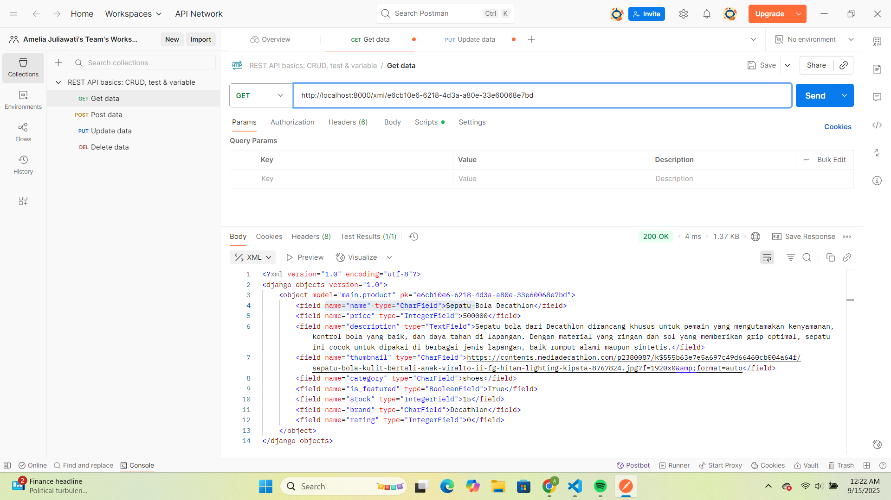

**Jelaskan mengapa kita memerlukan data delivery dalam pengimplementasian sebuah platform?**

Dalam mengimplementasikan suatu platform, seringkali diterapkan konsep data delivery yaitu proses mengenai bagaimana suatu data dikirim atau didistribusikan hingga dapat digunakan oleh pengguna ataupun sistem lain dengan cara yang tepat, cepat, dan aman. Utamanya, hal ini diperlukan agar suatu platform dapat menyajikan dan menerima data dari pengguna (misalnya platform yang perlu meminta data pengguna) dengan cepat dan tepat. Dalam pembuatan suatu platform, biasanya terdapat banyak komponen yang saling membutuhkan data satu sama lain, misalnya dalam proyek ini dibutuhkan data dalam format XML dan JSON, atau HTML yang mengambil data dari views.py untuk menampilkan halaman yang sesuai. Dengan adanya data delivery, dapat dipastikan bahwa semua komponen menerima data yang sama, terbaru, dan konsisten. Selain itu, data delivery juga mendukung performa platform agar lebih responsif terhadap pengguna. Tanpa data delivery yang baik, informasi dapat telat sampai, tidak konsisten, atau bahkan salah, khususnya pada platform yang membutuhkan data real-time. Kondisi ini tentunya dapat membuat pengalaman pengguna menjadi buruk, misalnya ketika data tidak terkirim atau lambat. Selain itu, dengan mekanisme pengiriman data yang terstruktur, platform juga dapat menghindari redundansi dan meminimalkan beban sistem dari risiko pengiriman data berulang. Data delivery juga memungkinkan integrasi antar sistem dapat berjalan dengan lancar, terlebih untuk platform yang terhubung dengan layanan atau sistem pihak ketiga, misalnya sistem pembayaran di aplikasi e-commerce.

**Menurutmu, mana yang lebih baik antara XML dan JSON? Mengapa JSON lebih populer dibandingkan XML?**

JSON (JavaScript Object Notation) dan XML (eXtensible Markup Language) adalah format yang digunakan untuk menyimpan, membaca, dan menukar data dari suatu web server sehingga dapat diakses dan dibaca oleh pengguna. Meskipun memiliki fungsi yang mirip, keduanya memiliki perbedaan yang cukup signifikan. Salah satu perbedaan mendasar adalah cara menyimpan elemen. JSON menyimpan elemen dengan efisien melalui struktur sederhana seperti array, object, dan nilai primitif. Namun, hasil penyimpanannya seringkali dianggap kurang rapi. Sedangkan XML menyimpan elemen menggunakan struktur yang lebih kompleks dan terorganisir dengan baik, sehingga mudah dibaca oleh manusia maupun mesin, tetapi kurang efisien karena membutuhkan lebih banyak tag. Kemudian untuk penerapannya, JSON umumnya digunakan untuk mengirimkan data dengan diuraikan dan dikirim melalui internet karena lebih ringan dan mudah diproses, sedangkan XML lebih terstruktur dan pengguna juga dapat menggunakannya untuk menambahkan suatu catatan. XML lebih sering digunakan pada sistem atau aplikasi lama, sedangkan JSON lebih cocok untuk aplikasi modern. Oleh karena itu, penggunaan XML dan JSON dapat disesuaikan tergantung dengan tujuan penggunaan. Menurut saya, JSON adalah format yang lebih baik untuk digunakan dikarenakan sistem penyimpanan data yang sederhana (dilakukan dalam bentuk array dan object) sehingga proses transfer data dapat menjadi lebih mudah. Pada saat ini, tidak dapat dipungkiri bahwa JSON jauh lebih populer dibandingkan dengan XML. Hal ini disebabkan oleh keunggulan JSON, yaitu mendukung banyak bahasa pemrograman, lebih efisien karena sintaksnya ringan dan berukuran kecil, lebih mudah dibaca oleh karena bentuknya yang ringkas (berupa array dan object), serta lebih cepat dalam proses parsing di sisi server. Kelebihan-kelebihan tersebut membuat JSON menjadi lebih unggul dan sesuai untuk platform modern yang harus menangani data dalam jumlah besar secara cepat.

**Jelaskan fungsi dari method is_valid() pada form Django dan mengapa kita membutuhkan method tersebut?**

Method *is_valid* pada form Django berfungsi untuk mengecek apakah data yang dikirimkan ke form telah sesuai dengan aturan validasi yang telah didefinisikan sebelumnya (di model atau form). Tentunya dalam sebuah platform, ketika pengguna ingin memasukkan sebuah data, pengembang biasanya telah menentukan terlebih dahulu data apa saja yang diterima (misal nama, harga, deskripsi, dan lain-lain), tipe data yang benar, serta batasan dalam penerimaan data tersebut. Dengan dijalankannya metode ini, Django akan memeriksa apakah semua field yang wajib diisi sudah terisi. Setelah itu, akan dilakukan validasi tipe data, misalnya memastikan bahwa price meminta tipe data berupa angka (long atau integer), bukan string. Django juga akan memeriksa apabila ada batasan khusus yang mungkin ditambahkan melalui validators. Jika semua validasi terpenuhi, maka *is_valid* akan mengembalikan nilai True sehingga data dapat diakses dan diproses. Sebaliknya, jika terjadi suatu error atau adanya kesalahan input, maka *is_valid* akan mengembalikan False dan Django akan menyediakan pesan error yang dapat ditampilkan ke pengguna. Dalam mengelola suatu platform, tentunya kita harus memastikan bahwa data yang diterima sesuai dengan kebutuhan dan aturan yang berlaku. Hal inilah yang membuat metode *is_valid* dibutuhkan. Metode ini akan menjamin data yang masuk aman, konsisten, dan sesuai dengan aturan serta batasan yang ada. Hal ini dapat membantu untuk mencegah terjadinya suatu kerusakan di database akibat data yang salah atau tidak sesuai. Selain itu, metode ini juga sangat bermanfaat untuk pengguna jika salah melakukan input karena akan ada pesan langsung yang ditampilkan padanya.

**Mengapa kita membutuhkan csrf_token saat membuat form di Django? Apa yang dapat terjadi jika kita tidak menambahkan csrf_token pada form Django? Bagaimana hal tersebut dapat dimanfaatkan oleh penyerang?**

 *csrf_token* pada Django merupakan suatu lapisan keamanan yang digunakan untuk mencegah serangan CSRF (Cross-Site Request Forgery). *csrf_token* adalah suatu nilai unik, rahasia, dan tidak dapat diprediksi yang dibuat oleh server dan disimpan pada sesi pengguna. Ketika pengguna mencoba untuk melakukan suatu hal yang bersifat sensitif, misalkan mengirimkan sebuah form, maka Django akan memeriksa apakah token yang dikirim bersama form cocok dengan token yang ada pada sesi pengguna. Jika cocok, maka request dianggap valid dan akan diproses lebih lanjut. Namun, bila tidak cocok, maka request tersebut akan ditolak. Hal ini membuat penyerang sangat kesulitan untuk membuat request atau melakukan aksi berbahaya seperti berperan sebagai pengguna asli dikarenakan tidak memiliki token tersebut. 

 Jika kita tidak menambahkan *csrf_token* saat membuat form di Django, aplikasi akan menjadi rentan terhadap serangan CSRF. CSRF adalah suatu jenis penyerangan dimana penyerang membuat browser korban mengirimkan request ke web tujuan tanpa sepengetahuan korban. Dikarenakan browser otomatis mengirimkan cookie sesi, server tujuan akan mengira bahwa itu adalah request valid dari korban yang membuat korban "terpaksa" melakukan request yang tidak ia inginkan. Jika tidak ada *csrf_token* sebagai salah satu cara preventatif penyerangan CSRF, maka server tidak dapat mengetahui apakah request yang dikirimkan benar-benar berasal dari pengguna atau berasal dari penyerang. Hal ini dikarenakan tidak ada alat bantu yang dapat mengecek dan memastikan hal tersebut. Hal ini dapat dimanfaatkan oleh penyerang dengan cara memaksa masuk dan membuat request yang membuat korban "terpaksa" melakukan suatu request ke suatu server. Salah satu contoh CSRF adalah ketika suatu pengguna login di suatu web yang tidak menggunakan *csrf_token*, maka browser akan menyimpan cookie sesi. Penyerang yang telah membuat halaman berisi form tersembunyi mengirim POST ke web tersebut untuk mengganti email agar dapat mengambil alih akun pengguna. Pengguna yang tidak tahu tidak sengaja mengunjungi halaman penyerang di tab lain dan script pun otomatis melakukan submit form. Browser pengguna akan mengirim request ke web tersebut dan request akan diproses karena dianggap berasal dari pengguna. Akhirnya, email berubah tanpa sepengetahuan korban.

**Jelaskan bagaimana cara kamu mengimplementasikan checklist di atas secara step-by-step (bukan hanya sekadar mengikuti tutorial).**

**Menambahkan 4 fungsi views baru**

1. Menambahkan import *Product*, *HttpResponse*, dan *Serializer* pada *views.py* sebagai class yang dibutuhkan
2. Membuat fungsi *show_xml* yang menerima input berupa request dari pengguna dan mengembalikan data semua objek dari Product dalam bentuk format XML
3. Membuat fungsi *show_json* yang menerima input berupa request dari pengguna dan mengembalikan data semua objek dari Product dalam bentuk format JSON
4. Membuat fungsi *show_xml_by_id* yang menerima input berupa request dari pengguna dan sebuah id produk. Fungsi ini akan mengembalikan data suatu objek dari Product dengan id tersebut dalam bentuk format XML
5. Membuat fungsi *show_json_by_id* yang menerima input berupa request dari pengguna dan sebuah id produk. Fungsi ini akan mengembalikan data suatu objek dari Product dengan id tersebut dalam bentuk format JSON

**Membuat routing URL**

1. Menambahkan import fungsi yang telah dibuat yaitu *show_xml, show_json, show_xml_by_id, show_json_by_id* pada *urls.py* 
2. Menambahkan keempat path URL ke dalam *urlpatterns* untuk dapat mengakses fungsi yang sudah diimpor tadi.

**Membuat halaman yang memiliki tombol "Add" dan "Detail"**

1. Membuat direktori templates dan file bernama *base.html* yang berguna sebagai kerangka umum (layout) proyek HTML.
2. Menambahkan templates sebagai directory di *settings.py* agar file *base.html* dapat dikenali oleh Django
3. Membuat file baru bernama *forms.py* pada direktori *main* untuk mendefinisikan struktur form yang menerima input data produk baru.
4. Menambahkan import baru pada *views.py*, yaitu redirect, get_object_or_404, dan ProductForm sebagai kelas atau fungsi yang dapat digunakan pada *views.py*
5. Membuat fungsi baru, yaitu *create_products* untuk menambahkan suatu produk baru. Fungsi ini menerima input request dari pengguna dan akan memberikan hasil yaitu Product yang telah dibuat jika isi form valid dan pengguna telah mengirim data dengan metode POST.
6. Membuat fungsi baru, yaitu *show_products* untuk menampilkan detail suatu produk. Fungsi ini menerima input berupa request dan juga suatu id produk dan akan memberikan informasi berupa detail suatu produk dalam bentuk halaman yang telah dirender
7. Menambahkan suatu variabel baru yaitu *products_list* yang berisi semua data produk
8. Menambahkan *products_list* pada context fungsi *show_main*
9. Melakukan import fungsi yang telah dibuat pada *urls.py* pada direktori *main*
10. Menambahkan path URL kedua fungsi tersebut ke dalam variabel *urlpatterns*
11. Mengubah dan menyesuaikan halaman *main.html* pada direktori *main/templates* agar dapat menampilkan data produk serta tombol "Add" dan "Detail". Untuk menambahkan suatu tombol digunakan keyword <button>, yang digunakan untuk membuat tombol "Add" dan "Detail". Selain itu, setiap tombol menggunakan atribut href (hyperlink reference) agar dapat mengarah ke halaman yang sesuai. Button "Add Products" akan mengarahkan ke *create_products.html*, lalu button "View Detail" akan mengarahkan ke *products_detail.html*.

**Membuat halaman form**

1. Membuat file baru, yaitu *create_products.html* pada direktori *main/templates*.
2. Menambahkan kode pada *create_products.html* untuk menampilkan template form ketika diisi oleh pengguna. File ini juga meng-extend *base.html*
3. Menambahkan entri url proyek pws pada CSRF_TRUSTED_ORIGINS di *settings.py* agar url proyek dianggap aman saat melakukan request POST

**Membuat halaman yang menampilkan detail**

1. Membuat suatu file baru, yaitu *products_detail.html* pada direktori *main/templates*.
2. Menambhakn kode pada file tersebut sebagai template ketika pengguna melihat detail suatu produk. File ini juga meng-extend *base.html*

**Apakah ada feedback untuk asdos di tutorial 2 yang sudah kalian kerjakan?**

Asdos telah membimbing saya untuk mengikuti tutorial dengan sangat baik dan jelas.

**Screenshot URL pada Postman**

1. show_xml

2. show_json

3. show_xml_by_id

4. show_json_by_id

